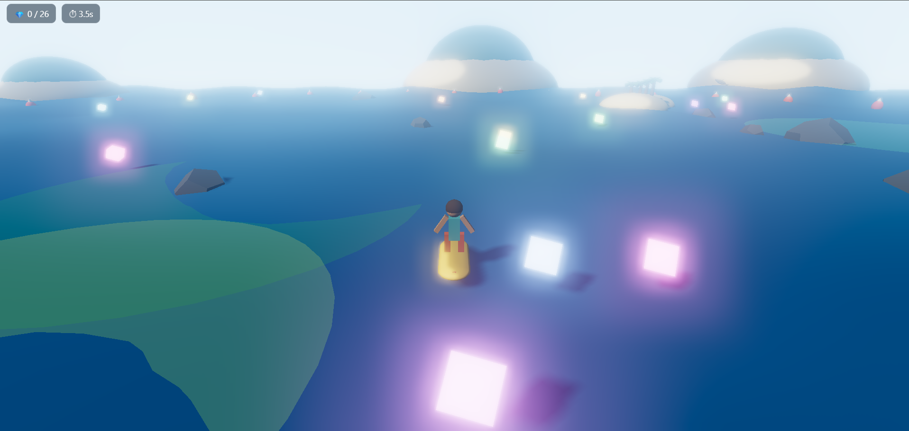
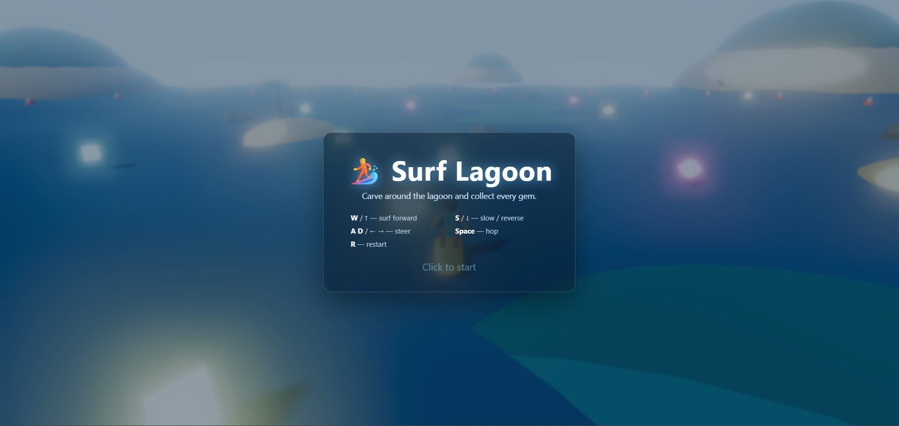

# 🏄 Surf Lagoon

A real-time 3D browser game built on **Three.js** and **WebGL** — steer a surfer around a buoy-ringed lagoon, carve through an animated shader-driven ocean, and collect every glowing gem against the clock. **The interesting parts aren't what the framework gives you for free — they're the hand-written GLSL shaders and from-scratch movement physics layered on top.**

🔗 **Play it live:** [**anubhavmehandru.github.io/surf-lagoon**]([https://anubhavmehandru.github.io/surf-lagoon/](https://anubhavmehandru.github.io/Surf-Lagoon/))

  



---

## ✨ Highlights

- **Custom GLSL ocean** — a flat plane displaced in the vertex shader by summed sine waves, with **analytically-derived normals** so lighting and reflections stay correct as the surface moves (not a static normal map).
- **Custom GLSL sky** — a gradient sky-dome shader instead of an off-the-shelf helper, so there's no light-clipping glare on the horizon.
- **Movement physics, from scratch** — momentum-based acceleration and drag, turn-lean, gravity + hop, and **axis-separated collision resolution** so the surfer slides along obstacles and the boundary instead of sticking.
- **Modular engine** — gameplay is split into focused modules under [`src/`](src/) and tuned from a single [`config.js`](src/config.js), so the entire feel of the game re-balances from one file.
- **Cinematic rendering** — PCF soft shadows, ACES filmic tone mapping, and an `UnrealBloomPass` so the emissive gems glow.

---

## 🎮 Controls



| Key | Action |
|-----|--------|
| `W` / `↑` | Surf forward |
| `S` / `↓` | Slow / reverse |
| `A` `D` / `← →` | Steer |
| `Space` | Hop |
| `R` | Restart |

Collect all the gems to win — your time is tracked in the HUD.

---

## 🗂 Project structure

```
├── index.html        → page shell + start screen / HUD markup
├── main.js           → entry point (boots the Game)
├── style.css         → start screen, HUD, and banner styling
├── package.json
└── src/
    ├── Game.js          → orchestrator: renderer, scene, post-processing, game loop
    ├── World.js         → ocean (wave shader), gradient sky, lighting, boundary buoys
    ├── Surfer.js        → player model + movement physics
    ├── FollowCamera.js  → third-person chase camera (exponential smoothing)
    ├── Obstacles.js     → palm islands & rocks with circular colliders
    ├── Gems.js          → collectible emissive gems
    ├── Scenery.js       → distant islands & leaping dolphins (outside the lagoon)
    ├── Input.js         → keyboard state
    ├── HUD.js           → DOM overlay (start screen, gem counter, timer, banner)
    └── config.js        → central tuning knobs for the whole game
```

---

## 🛠 Under the hood

**Rendering pipeline.** A `WebGLRenderer` with PCF soft shadow maps and ACES filmic tone mapping feeds an `EffectComposer` chain: `RenderPass` → `UnrealBloomPass` → `OutputPass`. Bloom is thresholded so only the emissive gems glow, not the rest of the scene.

**The ocean.** Rather than a custom material that loses Three.js lighting, the water uses `MeshStandardMaterial.onBeforeCompile` to inject wave displacement and recomputed normals directly into the standard shader — so it still receives real directional light and shadows while it moves. Normals are derived analytically from the wave function (the partial derivatives of the summed sines) rather than sampled, which keeps the lighting crisp and cheap.

**Collision.** Obstacles are circular colliders. Resolution is **axis-separated** — the surfer's X and Z motion are tested and corrected independently — so hitting a rock at an angle makes you slide along it instead of stopping dead.

---

## 🚀 Build & run

**Requirements:** Node.js 18+ and a WebGL2-capable browser.

```bash
npm install
npm run dev      # dev server with hot reload, opens the game
npm run build    # static production build into dist/
```

Bundled with **Parcel**; the GLSL transformer imports shader files as strings.

---

## 🌐 Deploying

The build is fully static, so it works on any static host:

- **GitHub Pages** — `npm run build`, then publish `dist/` (e.g. `npx gh-pages -d dist`) and enable Pages for that branch. The build already uses relative asset paths (`--public-url ./`).
- **Netlify / Vercel / Cloudflare Pages** — connect the repo with build command `npm run build` and output directory `dist`.

Update the **Play it live** link above once it's deployed.

---

## 📄 License

Released under the [MIT License](LICENSE).
